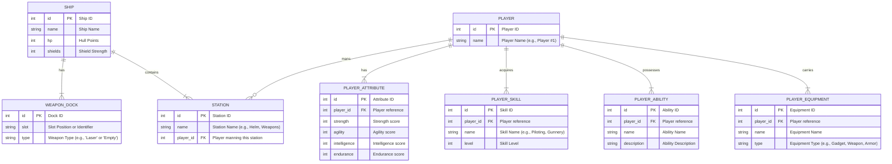

To Be Planned Sprints:
 - Architecture, tool selection, mockups, services needed
 - Build base interface in svelte - see preliminary mockup in architecture/mockups
 - Data model for ships, stats, abilities, characters, equipment, skills, etc
 - Build interface for the following for GM & Player
	 - Left Pane:
		 - Ship:
			 - Attributes/Stats
				 - HP
				 - Shields
				 - Weapon Docks
					 - Laser
					 - Empty
					 - Empty
			 - Stations:
				 - Helm
					 - Player #1
						 - Attributes
						 - Skills
						 - Abilities
						 - Equipment
				 - Weapons
					 - - Player #1
						 - Attributes
						 - Skills
						 - Abilities
						 - Equipment
	 - Right:
		 - Same as left, but list of ships
		 - Eventually 
	 - 

