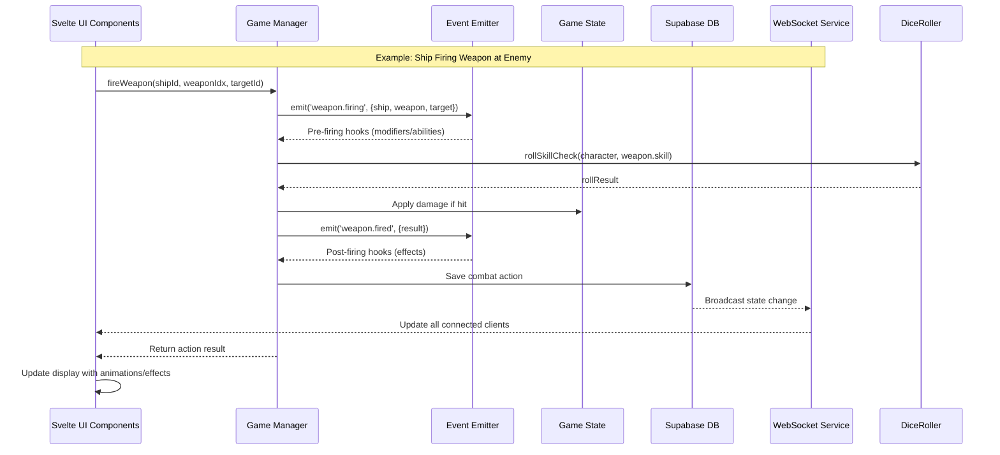

```mermaid
sequenceDiagram
    participant UI as Svelte UI Components
    participant GM as Game Manager
    participant EM as Event Emitter
    participant GS as Game State
    participant DB as Supabase DB
    participant WS as WebSocket Service
    
    Note over UI,WS: Example: Ship Firing Weapon at Enemy
    
    UI->>GM: fireWeapon(shipId, weaponIdx, targetId)
    GM->>EM: emit('weapon.firing', {ship, weapon, target})
    EM-->>GM: Pre-firing hooks (modifiers/abilities)
    GM->>DiceRoller: rollSkillCheck(character, weapon.skill)
    DiceRoller-->>GM: rollResult
    GM->>GS: Apply damage if hit
    GM->>EM: emit('weapon.fired', {result})
    EM-->>GM: Post-firing hooks (effects)
    GM->>DB: Save combat action
    DB-->>WS: Broadcast state change
    WS-->>UI: Update all connected clients
    GM-->>UI: Return action result
    UI->>UI: Update display with animations/effects
```
