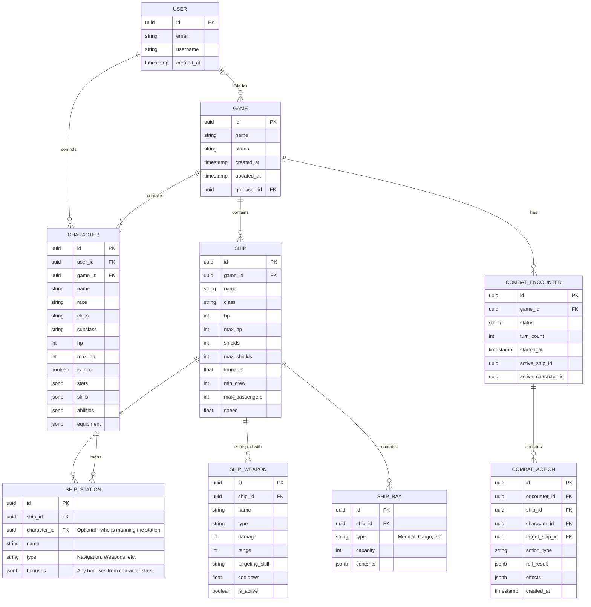

```style
	.mermaid {width: 1350px !important; max-width: 2000px;} 
	.mermaid  svg { width: 1500px !important; max-width: 2000px;}
```


```mermaid
erDiagram
    GAME {
        uuid id PK
        string name
        string status
        timestamp created_at
        timestamp updated_at
        uuid gm_user_id FK
    }
    
    USER {
        uuid id PK
        string email
        string username
        timestamp created_at
    }
    
    CHARACTER {
        uuid id PK
        uuid user_id FK
        uuid game_id FK
        string name
        string race
        string class
        string subclass
        int hp
        int max_hp
        boolean is_npc
        jsonb stats
        jsonb skills
        jsonb abilities
        jsonb equipment
    }
    
    SHIP {
        uuid id PK
        uuid game_id FK
        string name
        string class
        int hp
        int max_hp
        int shields
        int max_shields
        float tonnage
        int min_crew
        int max_passengers
        float speed
    }
    
    SHIP_STATION {
        uuid id PK
        uuid ship_id FK
        uuid character_id FK "Optional - who is manning the station"
        string name
        string type "Navigation, Weapons, etc."
        jsonb bonuses "Any bonuses from character stats"
    }
    
    SHIP_WEAPON {
        uuid id PK
        uuid ship_id FK
        string name
        string type
        int damage
        int range
        string targeting_skill
        float cooldown
        boolean is_active
    }
    
    SHIP_BAY {
        uuid id PK
        uuid ship_id FK
        string type "Medical, Cargo, etc."
        int capacity
        jsonb contents
    }
    
    COMBAT_ENCOUNTER {
        uuid id PK
        uuid game_id FK
        string status
        int turn_count
        timestamp started_at
        uuid active_ship_id
        uuid active_character_id
    }
    
    COMBAT_ACTION {
        uuid id PK
        uuid encounter_id FK
        uuid ship_id FK
        uuid character_id FK
        uuid target_ship_id FK
        string action_type
        jsonb roll_result
        jsonb effects
        timestamp created_at
    }
    
    USER ||--o{ GAME : "GM for"
    USER ||--o{ CHARACTER : "controls"
    GAME ||--o{ CHARACTER : "contains"
    GAME ||--o{ SHIP : "contains"
    GAME ||--o{ COMBAT_ENCOUNTER : "has"
    
    SHIP ||--o{ SHIP_STATION : "has"
    SHIP ||--o{ SHIP_WEAPON : "equipped with"
    SHIP ||--o{ SHIP_BAY : "contains"
    
    CHARACTER ||--o{ SHIP_STATION : "mans"
    
    COMBAT_ENCOUNTER ||--o{ COMBAT_ACTION : "contains"
```
