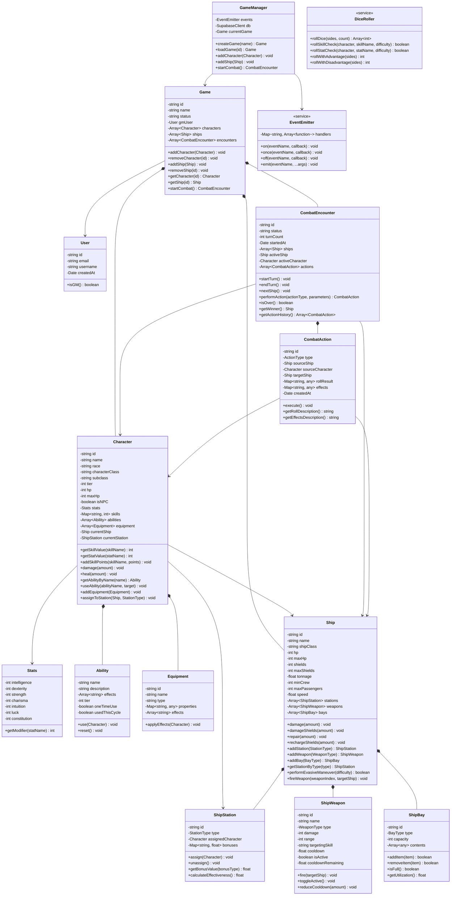

```mermaid
classDiagram
    class GameManager {
        -EventEmitter events
        -SupabaseClient db
        -Game currentGame
        +createGame(name) Game
        +loadGame(id) Game
        +addCharacter(Character) void
        +addShip(Ship) void
        +startCombat() CombatEncounter
    }
    
    class Game {
        -string id
        -string name
        -string status
        -User gmUser
        -Array~Character~ characters
        -Array~Ship~ ships
        -Array~CombatEncounter~ encounters
        +addCharacter(Character) void
        +removeCharacter(id) void
        +addShip(Ship) void
        +removeShip(id) void
        +getCharacter(id) Character
        +getShip(id) Ship
        +startCombat() CombatEncounter
    }
    
    class User {
        -string id
        -string email
        -string username
        -Date createdAt
        +isGM() boolean
    }
    
    class Character {
        -string id
        -string name
        -string race
        -string characterClass
        -string subclass
        -int tier
        -int hp
        -int maxHp
        -boolean isNPC
        -Stats stats
        -Map~string, int~ skills
        -Array~Ability~ abilities
        -Array~Equipment~ equipment
        -Ship currentShip
        -ShipStation currentStation
        +getSkillValue(skillName) int
        +getStatValue(statName) int
        +addSkillPoints(skillName, points) void
        +damage(amount) void
        +heal(amount) void
        +getAbilityByName(name) Ability
        +useAbility(abilityName, target) void
        +addEquipment(Equipment) void
        +assignToStation(Ship, StationType) void
    }
    
    class Stats {
        -int intelligence
        -int dexterity
        -int strength
        -int charisma
        -int intuition
        -int luck
        -int constitution
        +getModifier(statName) int
    }
    
    class Ability {
        -string name
        -string description
        -Array~string~ effects
        -int tier
        -boolean oneTimeUse
        -boolean usedThisCycle
        +use(Character) void
        +reset() void
    }
    
    class Equipment {
        -string id
        -string name
        -string type
        -Map~string, any~ properties
        -Array~string~ effects
        +applyEffects(Character) void
    }
    
    class Ship {
        -string id
        -string name
        -string shipClass
        -int hp
        -int maxHp
        -int shields
        -int maxShields
        -float tonnage
        -int minCrew
        -int maxPassengers
        -float speed
        -Array~ShipStation~ stations
        -Array~ShipWeapon~ weapons
        -Array~ShipBay~ bays
        +damage(amount) void
        +damageShields(amount) void
        +repair(amount) void
        +rechargeShields(amount) void
        +addStation(StationType) ShipStation
        +addWeapon(WeaponType) ShipWeapon
        +addBay(BayType) ShipBay
        +getStationByType(type) ShipStation
        +performEvasiveManeuver(difficulty) boolean
        +fireWeapon(weaponIndex, targetShip) void
    }
    
    class ShipStation {
        -string id
        -StationType type
        -Character assignedCharacter
        -Map~string, float~ bonuses
        +assign(Character) void
        +unassign() void
        +getBonusValue(bonusType) float
        +calculateEffectiveness() float
    }
    
    class ShipWeapon {
        -string id
        -string name
        -WeaponType type
        -int damage
        -int range
        -string targetingSkill
        -float cooldown
        -boolean isActive
        -float cooldownRemaining
        +fire(targetShip) void
        +toggleActive() void
        +reduceCooldown(amount) void
    }
    
    class ShipBay {
        -string id
        -BayType type
        -int capacity
        -Array~any~ contents
        +addItem(item) boolean
        +removeItem(item) boolean
        +isFull() boolean
        +getUtilization() float
    }
    
    class CombatEncounter {
        -string id
        -string status
        -int turnCount
        -Date startedAt
        -Array~Ship~ ships
        -Ship activeShip
        -Character activeCharacter
        -Array~CombatAction~ actions
        +startTurn() void
        +endTurn() void
        +nextShip() void
        +performAction(actionType, parameters) CombatAction
        +isOver() boolean
        +getWinner() Ship
        +getActionHistory() Array~CombatAction~
    }
    
    class CombatAction {
        -string id
        -ActionType type
        -Ship sourceShip
        -Character sourceCharacter
        -Ship targetShip
        -Map~string, any~ rollResult
        -Map~string, any~ effects
        -Date createdAt
        +execute() void
        +getRollDescription() string
        +getEffectsDescription() string
    }
    
    class DiceRoller {
        <<service>>
        +rollDice(sides, count) Array~int~
        +rollSkillCheck(character, skillName, difficulty) boolean
        +rollStatCheck(character, statName, difficulty) boolean
        +rollWithAdvantage(sides) int
        +rollWithDisadvantage(sides) int
    }
    
    class EventEmitter {
        <<service>>
        -Map~string, Array~function~~ handlers
        +on(eventName, callback) void
        +once(eventName, callback) void
        +off(eventName, callback) void
        +emit(eventName, ...args) void
    }
    
    GameManager --> Game
    GameManager --> EventEmitter
    Game --> User
    Game *-- Character
    Game *-- Ship
    Game *-- CombatEncounter
    Character --> Stats
    Character *-- Ability
    Character *-- Equipment
    Character --> Ship
    Character --> ShipStation
    Ship *-- ShipStation
    Ship *-- ShipWeapon
    Ship *-- ShipBay
    CombatEncounter --> Ship
    CombatEncounter --> Character
    CombatEncounter *-- CombatAction
    CombatAction --> Ship
    CombatAction --> Character
```
